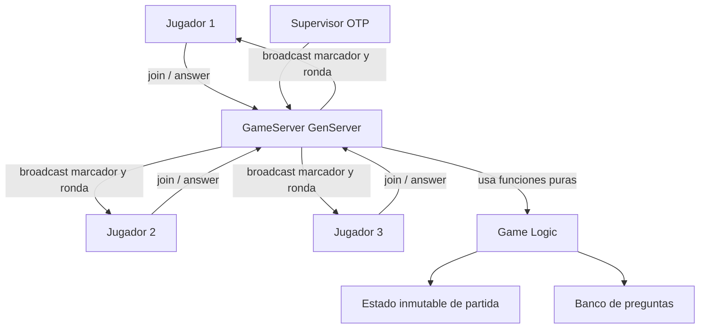

# Avance 1: Definicion del Juego y Lenguaje

## Nombre del proyecto

**Trivia Crack Quiz Multiplayer**

## Tipo de juego

Juego multijugador de trivia por turnos rapidos inspirado en Trivia Crack: Brain
Quiz Games. La partida permite minimo 3 jugadores conectados al mismo servidor.
Cada ronda presenta preguntas de distintas categorias y tipos. Los jugadores
responden dentro de un tiempo limite y reciben puntos segun si aciertan y segun
la rapidez de respuesta.

## Lenguaje elegido

El proyecto se desarrollara en **Elixir**, porque cumple de forma natural con el
paradigma funcional solicitado:

- Usa estructuras de datos inmutables como mapas, listas, tuplas y structs.
- Permite separar la logica del juego en funciones puras.
- Usa procesos ligeros de Erlang/OTP para concurrencia.
- Implementa comunicacion entre procesos mediante paso de mensajes.
- Facilita supervisar procesos con `Supervisor` y mantener estado con
  `GenServer`.

## Reglas principales

1. La partida inicia cuando hay al menos 3 jugadores registrados.
2. Cada jugador tiene nombre, puntaje, estado de conexion y ultima accion.
3. En cada ronda se selecciona una pregunta.
4. Todos los jugadores reciben la misma pregunta.
5. Cada jugador envia una respuesta.
6. El servidor valida respuestas y actualiza puntajes.
7. Al terminar la ronda, se notifica el marcador a todos los jugadores.
8. Gana quien tenga mayor puntaje al finalizar la cantidad definida de rondas.

## Tipos de preguntas

- **Opcion multiple:** una pregunta con varias alternativas y una respuesta
  correcta.
- **Verdadero o falso:** afirmacion que debe marcarse como verdadera o falsa.
- **Respuesta rapida:** pregunta corta donde se compara una respuesta textual
  normalizada.
- **Categoria sorpresa:** pregunta elegida aleatoriamente entre ciencia,
  historia, deportes, arte, tecnologia o cultura general.

## Estructuras de datos propuestas

```elixir
%{
  phase: :waiting | :playing | :finished,
  players: %{
    "player_id" => %{
      name: "Ana",
      score: 0,
      connected?: true,
      last_action: :joined
    }
  },
  round: 1,
  max_rounds: 10,
  current_question: %{
    id: 1,
    type: :multiple_choice,
    category: :science,
    text: "Pregunta",
    options: ["A", "B", "C", "D"],
    answer: "A"
  },
  answers: %{}
}
```

## Estrategia de concurrencia

El servidor central de la partida sera un `GenServer` llamado
`TriviaCrackQuiz.GameServer`. Este proceso mantiene el estado actual de la
partida. Cada jugador se representara como un proceso cliente o canal de
comunicacion que envia mensajes al servidor.

Mensajes principales:

- `{:join, player_id, name}` para registrar un jugador.
- `{:start_game}` para iniciar cuando existan minimo 3 jugadores.
- `{:answer, player_id, answer}` para responder la pregunta actual.
- `{:next_round}` para avanzar de ronda.
- `{:state}` para consultar el estado visible de la partida.

La coherencia del estado se mantiene porque solo el `GameServer` modifica el
estado de la partida, recibiendo eventos uno por uno en su bucle de mensajes.
Cada transformacion del estado se delega a funciones puras del modulo
`TriviaCrackQuiz.Game`.

## Borrador del diagrama de estructura



## Modulos principales

- `TriviaCrackQuiz.Application`: inicia la aplicacion OTP y el arbol de
  supervision.
- `TriviaCrackQuiz.GameServer`: proceso actor que recibe mensajes, mantiene el
  estado y coordina la partida.
- `TriviaCrackQuiz.Game`: funciones puras para crear estado, registrar
  jugadores, validar respuestas y calcular puntajes.
- `TriviaCrackQuiz.QuestionBank`: banco inicial de preguntas.

## Alcance del avance siguiente

Para el Avance 2 se implementara la partida al 50%:

- Registro real de minimo 3 jugadores.
- Inicio de partida.
- Seleccion de preguntas.
- Envio y validacion de respuestas.
- Marcador compartido.
- Manual breve del lenguaje Elixir aplicado al proyecto.
